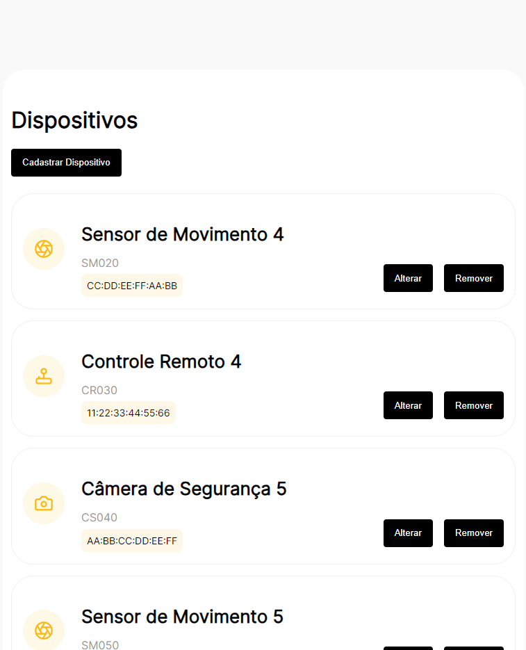
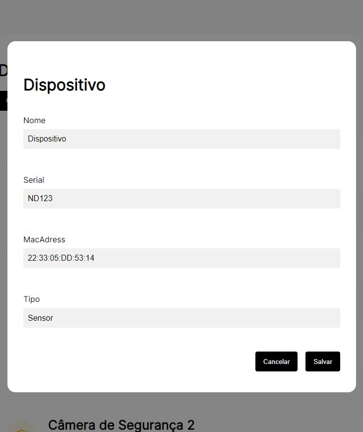
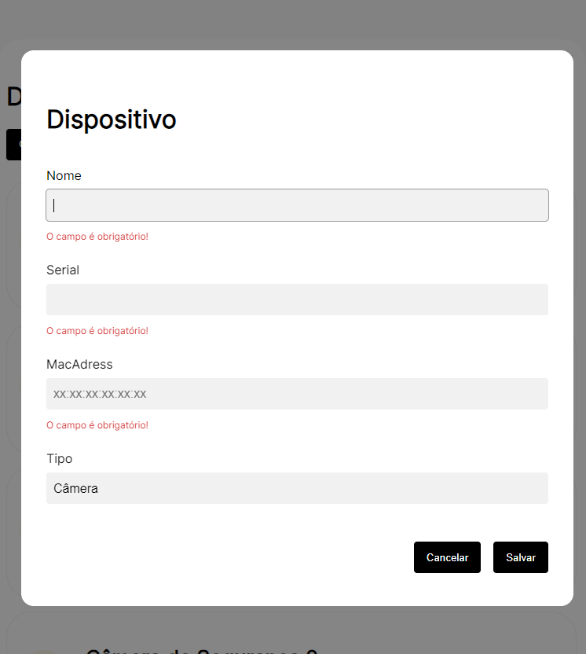
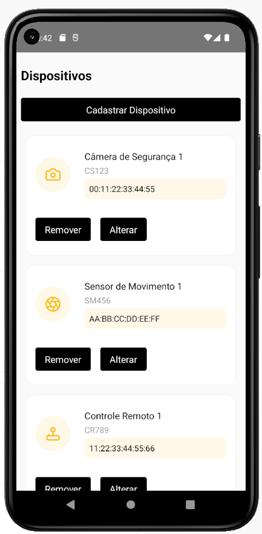
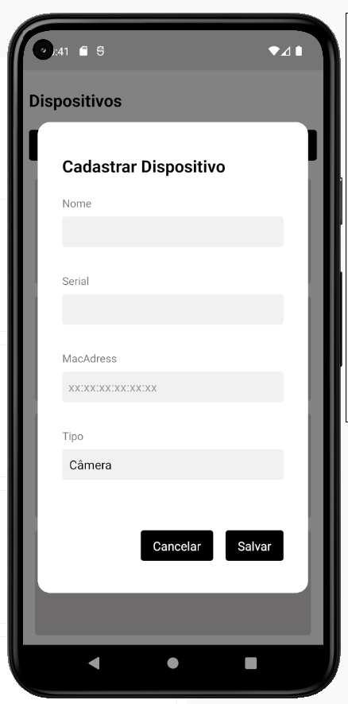
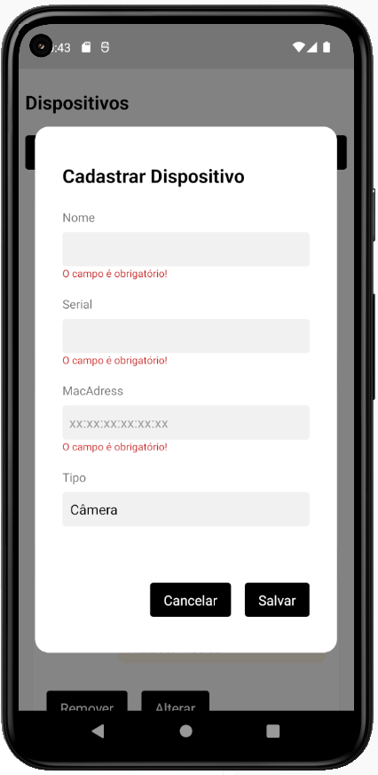
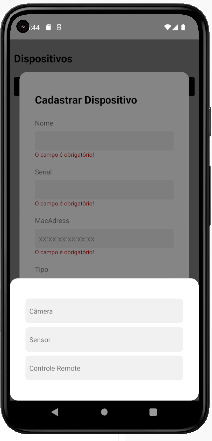

# ORSEGUPS - DEVICES

### Web




### Mobile





## 🚀 Usando o projeto Web

Para executar o projeto web, siga estas etapas:

Para instalar todas as dependências execute

```
yarn
```

Agora que tudo está preparado, execute

```
yarn dev
```

Para fazer o uso do projeto, acesse

```
http://localhost:3000
```

## 🚀 Usando o projeto Mobile

Para executar o projeto mobile, siga estas etapas:

Para instalar todas as dependências execute

```
yarn
```

Em `mobile/src/services/utils/Api.tsx` Altere a `URL` para o IP de sua máquina.

Para visualizar o IP (ipv4) de sua máquina entre no CMD e execute
```
ipconfig
```

Agora que tudo está preparado, execute

```
yarn android
```